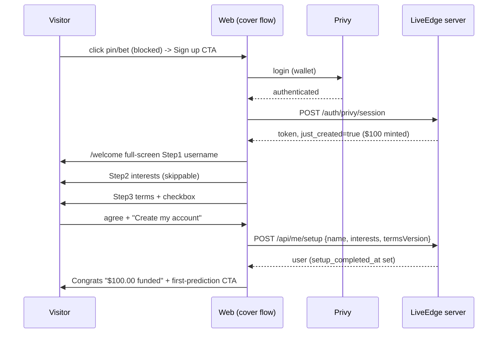

# ONBOARDING PLAN — full-screen sign-up cover flow (PLANNING ONLY — not implemented)

Owner brief (2026-10-05, voice note): logged-out visitors SEE everything but DO
nothing (no pin, no bet, no portfolio — browse-only). Clicking Sign up opens a
FULL-SCREEN cover flow (desktop: covers the screen) that asks username + basics,
requires Terms agreement, and ENDS with a "Congratulations — your account has
been funded with $100" moment. Research was run to correct/enhance this; the
core idea survived and is adopted.

## 1. What the global research says (and how it maps to us)

| Source | Finding | Adopted as |
|---|---|---|
| avark.agency — prediction-market design patterns 2026 | "Explore before committing" gate; a badly designed signup kills 40–60% of signups; onboarding IS the product | Tier 0 = full public browse, zero signup; trading gated behind setup |
| avark — Polymarket analysis | "Invisible Web3": embedded wallet created during signup; users never see seed phrases or addresses | Privy embedded Solana wallet appears ONLY as "account created" — never address-first UX |
| avark — Kalshi analysis | Visible compliance BUILDS trust when it explains why friction exists | Terms screen states plainly WHY: play money, no cash value, eligibility |
| avark — tiered identity pattern | Tier0 browse → Tier1 light account → Tier2 trade | We stop at Tier1+2 merged (sim money = no KYC), terms are the only "real" gate |
| DraftKings / bet365 welcome flow | Register → (deposit) → bonus claim congrats; the congrats IS the retention hook | Final "funded with $100" screen replaces the mid-flow welcome sheet |
| Robinhood | Fewest steps to first trade wins; every step = drop-off point | Max 3 steps after login; deep-CTA "Make your first prediction" |
| UX guidelines (ui-ux-pro-max, ux domain) | Progress indicator for multi-step; Skip/Back freedom EXCEPT irreversible consents; loading→success submit feedback | "Step 2 of 3" rail; interests skippable; terms NOT skippable; animated CTA states |

Correction to the owner's flow from research: ask **terms AFTER** the fun
questions (name, interests) — conversion platforms front-load value and push
the legal step to last, right before the reward. (DraftKings/Robinhood do this;
putting terms first measurably leaks users.) Everything else in the brief stands.

Note on "login with email": current locked decision (spec Amendment 1) is
WALLET-ONLY login. The flow below is login-method agnostic — if you want email
OTP back, it's a dashboard toggle + one spec sentence; say so explicitly.

## 2. The flow (diagram)

```
Visitor (no account, browse-only)
  │  sees Live feed, markets, prices — everything READ-ONLY
  │  tries to pin / bet / open Portfolio
  ▼
["Sign in to do that"] CTA  ──►  Privy modal (wallet login)  ──►  auth OK
  │                                                              (server: session
  │ new account?                                                    path c creates
  ▼                                                                user + mints $100)
FULL-SCREEN COVER: "/welcome" — no nav, no scroll, takeover
┌──────────────────────────────────────────────┐
│  LiveEdge              Step 1 of 3  ●○○      │
│  "What should we call you?"                  │
│  [ username input ______ ]  (inline valid.)  │
│                        [ Continue → ]        │
└──────────────────────────────────────────────┘
  Step 1 USERNAME   required (2–20, zod regex); Skip NOT allowed (identity)
  Step 2 INTERESTS  chips Trading&News / Sports / Live Streams; SKIPPABLE
  Step 3 TERMS      plain-language summary box (scrollable) + checkbox
                    "I agree to the Terms & Conditions. I understand this is
                    play money with no cash value." + eligibility line (see §5)
                    CTA: [ Create my account ]  (NOT clickable until checked)
  ▼
CONGRATS SCREEN (still in cover):
  confetti-free celebration: "$100.00" count-up +
  "Congratulations! Your account has been funded with $100 in play money."
  CTA [ Make your first prediction ] → feed, first card focused
```
Abandonment path: close tab mid-flow → account exists, $100 already minted
(server truth), setup incomplete. Next login lands directly on the missing step
with "Finish setting up" banner; betting stays blocked until Step 3 consent
(see server gate §4) — and the congrats screen shows then, once, at real
completion (honest: funds have been there; we announce at the true moment).

Mermaid:


## 3. Screen specs (desktop + mobile)
- Cover = route `/welcome`, full viewport, no TopNav/BottomTabs, `Esc` disabled
  mid-terms (users can leave between steps, not "accidentally"). Desktop ≥1024:
  two-column — left brand panel (logo, live-photo, step rail ●●○), right 480px
  step panel centered. <1024: single column, sticky bottom CTA (thumb zone),
  step count in header. Matches the mobile rules already in PRIVY spec.
- Progress indicator + Back button on every step (UX guideline #1/#2 above).
- Username step reuses the frozen zod regex validation inline (server is still
  the authority; no fake "availability" claim — names are not unique in our DB).
- Interests chips = the same vocabulary as tailoring: trading/sports/streams.
- Terms step: summary box + full Terms & Privacy links (/legal opens in new tab).
  Checkbox state persists only within the flow; the REAL record is server-side.
- Congrats: $100.00 count-up (600ms, reduced-motion static), play-money line
  MANDATORY, then single CTA deep into the feed. One-time per account (see flag).

## 4. Server delta (small; Agent A-style follow-up task, NOT in current build)
- migration `012_setup_terms.sql`:
  `users.terms_version text; users.terms_accepted_at timestamptz;
   users.setup_completed_at timestamptz;`
- `POST /api/me/setup` (auth): body { displayName, interests (0–3),
  termsVersion, accepted: literal true } — one transaction: profile write +
  terms fields + setup_completed_at; returns publicUser (+ setup_completed_at).
- Gate: order/claim routes return **403 TERMS_REQUIRED** when
  terms_accepted_at IS NULL. This is the honest technical enforcement of §5.
- publicUser extended with `setup_completed` boolean. Existing session response
  unchanged otherwise.
- Welcome latch: congrats shows when `just_created` OR (login && !setup_completed
  → after completing setup). No new endpoint needed; client uses publicUser.

## 5. Legal/eligibility honesty (flagged, not decided by me)
- We are SIM money, no payouts — the terms text must say so unambiguously
  ("play money has no cash value, cannot be deposited or withdrawn").
- Eligibility line: sportsbook-style age gating exists because real money is
  involved. For a sim-money product I recommend one checkbox: "I confirm I am
  at least 13 (or the age of digital consent in my country)." — **you own this
  choice (13 vs 17/18)**; app-store rules for simulated gambling push 17+.
- I will draft plain-language Terms + Privacy (hackathon-grade, clearly marked
  DRAFT — not legal advice) for your review before anyone implements Step 3.

## 6. What changes in the current plan/spec/agents
- PRIVY_AUTH_SPEC Amendment 2 stays law (no guests) — this plan REPLACES Agent
  C's deliverables 1–3 (welcome sheet BEFORE onboarding → congrats AFTER setup).
- **Agent C is NOT launched and must not be** until this plan is approved; its
  prompt gets a rewrite around /welcome (cover flow) + congrats, nav restructure
  and tailoring items unchanged.
- No implementation now. Deliverables when approved: (C) client cover flow,
  (A-follow-up) migration 012 + /api/me/setup + TERMS_REQUIRED gate, (lead)
  terms text draft + prompts.

## 7. Decisions needed from the owner (the only open questions)
1. Age line on terms checkbox: 13+ / 17+ / 18+? (recommend 17+, app-store safe)
2. Username required (current plan) or allow Skip with "there" fallback?
3. Email-OTP login truly OFF (wallet-only stands) — confirm after seeing the
   Privy modal change; the cover flow works with any login method.
4. Terms summary length: one paragraph (recommended) vs full ToS + Privacy pages?
