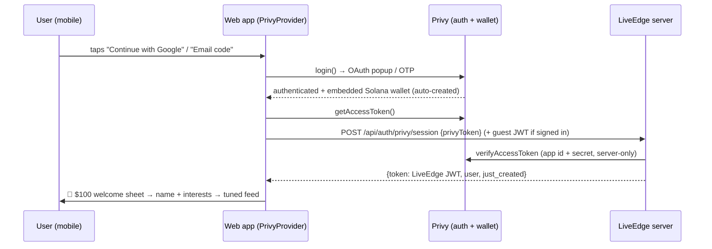

# PRIVY AUTH + ONBOARDING — FROZEN SPEC (build contract)

Status: FROZEN for the build agents. Decisions were made by the product owner on
2026-10-05. Do NOT re-litigate decisions in this file; if something here proves
wrong, STOP and report it — never silently deviate. Base for all work:
`feature/live-pins` @ c81b543 (the testing/integration branch).

## Decisions (locked)
- D1 — Privy embedded **Solana (Ed25519) wallet** becomes the signing key for
  logged-in users. Server verification (`verifyCanonical`, bs58 32-byte pubkey)
  stays UNCHANGED — a Privy embedded pubkey is exactly the shape `users.wallet`
  already stores. Guests keep the existing browser keypair path untouched.
- D2 — Email+password is REPLACED by Privy email OTP (+ Google). The old
  `/api/auth/register|login` routes stay alive during the migration only and are
  deleted in a later, separate, verified step.
- D3 — Privy's DEFAULT login modal is used (we own the trigger UI); custom
  login screens are explicitly out of scope.

## AMENDMENT 1 (owner decision, 2026-10-05 — supersedes parts of D2/D3)
- LOGIN IS **WALLET-ONLY**. Google and Email-OTP are NOT enabled.
  Privy auth methods to configure: Solana/Ethereum **wallet connect**
  (external wallets like Phantom) + **embedded Solana wallet**.
  D2's "replace password with email OTP" is shelved: the existing
  browser-keypair GUEST flow stays as today and IS the wallet login for
  users without an external wallet; password routes may be retired separately
  later — do not delete them in this build.
- Session exchange (spec §API contract 1) applies ONLY to Privy-authenticated
  users (wallet-connected). Guests keep nonce/verify + our JWT unchanged.
- OPEN VERIFICATION ITEM (Agent B spike, report as UNVERIFIED until proven):
  whether Privy creates embedded wallets for GUEST sessions
  (createOnLogin 'all-users') and whether a guest session can produce a
  privy access token at all. If guests have no token → guests never call
  /auth/privy/session (correct by design); embedded-wallet signing for guests
  is then out of scope and the spike only proves signing for a
  wallet-authenticated user.
- Welcome-reward trigger for Agent C: first creation of ANY account kind is
  already minted server-side (mint_events 'welcome'); C's sheet triggers on
  our-JWT creation for a brand-new user (guest OR privy session just_created),
  NOT on Privy login specifically.
- Env mechanism (CORRECTED after Agent B proved the original note wrong): client
  `VITE_*` vars reach the browser via **vite.config.js `envDir: '..'`** reading the
  ROOT .env; `scripts/dev.mjs` does NOT load any .env (the server loads its own
  in-process). `web/.env.local` is NOT the mechanism; agents must not create or
  edit any .env* file.

## Diagram flows (the plan, visualized)

A. New-user journey (login + wallet + reward + algorithm settings):
```
Visitor lands (guest, instant — no wall)
  → browses / pins streams (silent guest sign-in, as today)
  → taps avatar → "Sign in" (bottom sheet on mobile, button on desktop)
      → [Continue with Google]  |  [Email one-time code]      (Privy — no passwords, D2)
  → Privy auth → embedded Solana wallet auto-created (createOnLogin)
  → client: privy.getAccessToken() → POST /api/auth/privy/session
  → server: verifyAccessToken (appId+appSecret, server-only)
      a. privy_did known            → sign in
      b. guest JWT sent + privy new → ATTACH did to the guest account
                                         (balance, bets, pins all carry over)
      c. brand-new                  → create user, wallet = embedded bs58 pubkey
  → our 1h session JWT returned (all existing routes keep working unchanged)
  → 🎁 WELCOME REWARD SHEET (once, just_created=true)
      "$100.00" count-up 600ms · "Play money for predictions. Not real money."
  → ⚙️ ALGORITHM SETTINGS — "Set up your edge" (2 screens, skippable)
      1) display name (2–20 chars, inline validation)
      2) interest chips: Trading & News · Sports · Live Streams (skip = all)
  → PUT /api/me/profile → feed re-ranks LIVE:
      pinned streams first (always) → interest-matched REAL cards → rest
  → "Tuned for {name}" line under Live now (proves the choice did something)
```

B. Returning user:
```
app boot → PrivyProvider ready → cached access token?
  yes → POST /auth/privy/session (silent) → our JWT → /me hydrates name/interests/pins/balance
  no  → guest experience continues (pinning works via silent guest sign-in)
```

C. Claim signing (what changes vs today — nothing on the verify side):
```
today: guest keypair (browser) --sign--> verifyCanonical(wallet)        ✅ kept
new:   Privy embedded wallet (solana_signMessage raw bytes)
         --sign--> verifyCanonical(wallet)   ← SAME server code (Ed25519/bs58)
SPIKE GATE (Agent B, phase 0): prove the detached sig verifies with tweetnacl.
  SIGNING_FAIL → fallback: embedded wallet not used for signing; attached guest
  keypair keeps signing; everything else in this spec is unaffected.
```



## Environment / secrets (lead-only)
- Server `.env`: `PRIVY_APP_ID`, `PRIVY_APP_SECRET` (secret NEVER leaves server).
- Web `.env.local` (gitignored): `VITE_PRIVY_APP_ID` (+ `VITE_PRIVY_CLIENT_ID`
  if the dashboard lists one).
- Agents must NOT edit `.env*` files, must NOT hardcode keys anywhere, and must
  NOT run `git push`. The lead handles env + push + merge.

## Data model — migration `server/src/db/migrations/011_user_profile.sql`
```sql
alter table users add column if not exists privy_did text unique;
alter table users add column if not exists interests jsonb
  not null default '[]'::jsonb
  check (jsonb_typeof(interests) = 'array' and jsonb_array_length(interests) <= 3);
```
`display_name` already exists. Interest vocabulary (exact strings):
`'trading' | 'sports' | 'streams'`.

## API contract
1. `POST /api/auth/privy/session` — PUBLIC route (no auth middleware).
   - Body: `{ "privyToken": "<JWT from privy.getAccessToken()>" }`
   - Server verifies via `@privy-io/server-auth` `verifyAccessToken(privyToken,
     { appId, appSecret })` → `{ did, user: { external_wallets?, linked_accounts? } }`.
   - Identity resolution, in order:
     a. `users.privy_did = did` → sign that user in.
     b. Else if a VALID LiveEdge JWT was optionally sent in header
        (`authorization: Bearer <guestJwt>`) → attach `privy_did` to THAT guest
        user (upgrade; balance/pins kept) — this is the "continue as guest then
        log in" path.
     c. Else create new user: wallet = Privy embedded Solana address (bs58) if
        D1-spike passed, otherwise a fresh server-generated Ed25519 keypair is
        NOT created — instead 401 (fallback path uses guest flow b).
   - Response 200: `{ token, user: publicUser }` (same shape as `/auth/verify`).
   - Errors: 401 `UNAUTHORIZED` (bad/expired token, no wallet when D1 required).
2. `PUT /api/me/profile` — AUTH route.
   - Body (zod): `{ displayName: 2–20 chars /^[a-zA-Z0-9](?:[a-zA-Z0-9._-]*[a-zA-Z0-9])?$/, interests: array of 0–3 unique values from trading|sports|streams }`
   - Response 200: `{ user: publicUser }` (publicUser now also returns `interests`, `privy_linked: boolean`).
3. `GET /api/auth/me` — add `interests` + `privy_linked` to the payload. Nothing else changes.

## Client auth bridge (web)
- `PrivyProvider` wraps the app (`main.jsx`) with appId from `VITE_PRIVY_APP_ID`,
  `embeddedWallets: { solana: { createOnLogin: 'users-without-wallets' } }`.
- `useAuth` gains (guest path untouched):
  - `loginWithPrivy()`: `login()` → on authenticated: `getAccessToken()` →
    `POST /auth/privy/session` (sending the existing guest JWT if present) →
    `setToken(ourJwt)`; then `loadUser()` via `/me`.
  - Hydration: on mount, if `ready && authenticated` and no/foreign our-JWT →
    run the session exchange silently.
  - `signOut()` also calls Privy `logout()`.
- Claim/order signing: if the user has a Privy embedded wallet, sign via
  `wallet.getProvider().request({ method: 'solana_signMessage', params: [bytes, pubkey] })`
  (or SDK equivalent). PHASE-0 SPIKE GATE: prove detached signature verifies with
  `nacl.sign.detached.verify` against the bs58 pubkey on our `/api` fixtures.
  If the spike FAILS: D1 falls back to (b)-only (embedded wallet not used for
  signing; attached guest keypair keeps signing) — report, do not improvise.

## Welcome reward + "set up your edge" (web)
- Trigger: first successful PRIVY session for a brand-new account
  (`user.just_created: true` added to the session response) — never for guests,
  never twice (sessionStorage latch `liveedge_welcome_shown`).
- Sheet: greeting by display name (or first name of email/Google), `$100.00`
  count-up 600 ms (static under `prefers-reduced-motion`), copy MUST say
  "Play money for predictions. Not real money." CTA "Let's go" → onboarding.
- Onboarding = 2 skippable screens: (1) display name (inline validation,
  full-width input, sticky CTA), (2) interest chips (multi-select, labels:
  "Trading & News", "Sports", "Live Streams"; skip = all three). Calls
  `PUT /api/me/profile`. After save: feed re-ranks and a one-line
  "Tuned for {name}" note appears above Live now.
- Tailoring rule (honesty §4): re-rank/filter REAL data only — pinned first
  (existing mergePinnedFirst), then interest-matched categories via existing
  card `category`/`source` fields. NEVER fabricate streams/markets to fill an
  interest.

## Mobile hard rules (apply to every screen touched)
- ≥44px effective tap targets; no horizontal page scroll at 360px; inputs
  full-width; modals/sheets fit the viewport and scroll internally; bottom
  primary CTAs in the thumb zone; respect `prefers-reduced-motion` +
  `:focus-visible`. Acceptance viewports: 360, 390, 768, 1440.

## Testing + gates (every agent)
- Server: node --test, hermetic — Privy verification MOCKED by injection
  (`createPrivyVerifier()` passed into the router factory; tests pass a fake).
  No live network in tests. New money/profile paths keep the ledger invariant
  tests green.
- Web: pure logic extracted to `web/src/lib/*.js` with vitest (no jsdom).
- Full gates before reporting: `pnpm -r test`, `pnpm lint`,
  `node scripts/check-secrets.mjs` — all exit 0.

## Deliverable format each agent must report
1. Branch/worktree name + final commit hash(es) (conventional commits).
2. Files created/changed (exact list).
3. Commands run with their real tail output (gates).
4. Every spec deviation or blocker — explicitly, even if it "seemed fine".
5. Anything NOT done, said plainly. The lead re-runs gates and reads the diff
   before merging into `feature/live-pins`; unverified claims get rejected.
